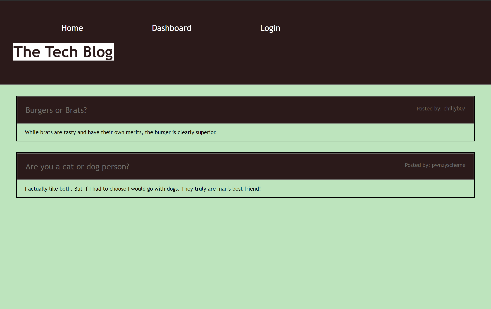

# Blog Session

## Hekroku Deployement
https://mod-14-blog-81b320cd3a6d.herokuapp.com/

## Description
This is an application that gives a backend structure to a commerce database

## Installation
N/A
    
## Usage
The user is able to:  
Sign up to a website.  
Cookie is stored for 1 minute, so they can exit the site and come back in that time and not have to sign in again.  
While logged in they can make a blog post, if they are not logged in they cannot.  
They can view their new post in the home page.  
They can logout whenever they wish.  
After they are logged out they can then log back in at the login page.
    
## Contribution Guidelines
N/A
    
## License
N/A
    
## Email Address
If you have any questions or concerns please reach out to me at bpoole53@gmail.com